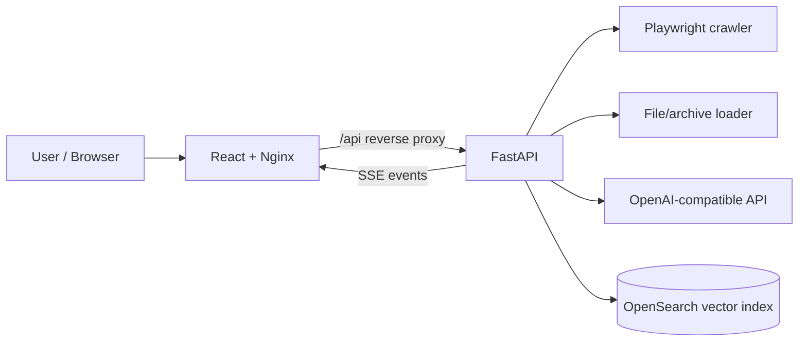

# Semantic Document Retrieval System

A Dockerized semantic retrieval and question-answering application for documentation portals and uploaded document collections. The system crawls or ingests source documents, chunks and embeds them, stores vectors in OpenSearch, reranks retrieved passages, and streams generated answers with source citations through a web UI and API.

## Table of Contents

- [Features](#features)
- [Architecture](#architecture)
- [Screenshots / API Examples](#screenshots--api-examples)
- [Requirements](#requirements)
- [Configuration](#configuration)
- [Run with Docker Compose](#run-with-docker-compose)
- [Typical Workflow](#typical-workflow)
- [API Reference](#api-reference)
- [Development](#development)
- [Roadmap](#roadmap)
- [License](#license)

## Features

- **Semantic document search** over a configured documentation website or uploaded files.
- **Hybrid retrieval pipeline** with dense embeddings, OpenSearch vector storage, reranking, and LLM answer generation.
- **Streaming UX** via Server-Sent Events (SSE) for indexing progress, search status, answer tokens, and source lists.
- **Web crawler mode** for documentation sites, including configurable page limits and wait time.
- **File upload indexing** for common office, text, web, data, and archive formats (`.pdf`, `.docx`, `.txt`, `.md`, `.html`, `.csv`, `.json`, `.xlsx`, `.pptx`, `.zip`, `.tar.gz`, and more).
- **Source-aware answers** that expose the chunks used to build the final response.
- **Single public entry point** through the frontend container; the backend stays inside the Docker network.
- **OpenAI-compatible model provider support** for embeddings, reranking, and chat/completion models.

## Architecture



### Components

- `frontend` — React application built with Vite and served by Nginx. Nginx also proxies `/api/*` requests to the backend.
- `backend` — FastAPI service that manages indexing tasks, search tasks, document loading, chunking, retrieval, reranking, and answer streaming.
- `OpenSearch` — expected external vector storage used by the backend for indexed chunks.
- `OpenAI-compatible API` — model endpoint used for embeddings, reranking, and answer generation.

## Screenshots / API Examples

### Web UI flow

1. Open the application at `http://localhost:${APP_PORT}`.
2. Click **Ввести адрес** to set a documentation URL, or **Выбрать файлы** to upload local documents.
3. Click **Индексация** and wait for the progress stream to finish.
4. Enter a question in the search box and submit it.
5. Read the streamed answer and inspect the cited sources.

> If you add actual screenshots later, a good convention is to place them under `docs/screenshots/` and reference them here.

### API examples

Check service health:

```bash
curl http://localhost:${APP_PORT}/api/health
```

Check indexing/search state:

```bash
curl http://localhost:${APP_PORT}/api/state
```

Start indexing from a documentation URL:

```bash
TASK_ID=$(curl -s -X POST http://localhost:${APP_PORT}/api/index/rebuild \
  -H 'Content-Type: application/json' \
  -d '{"src_base_url":"https://docs.pro-online.ru/","source_mode":"crawl"}' \
  | python -c 'import json,sys; print(json.load(sys.stdin)["task_id"])')

echo "$TASK_ID"
```

Stream indexing progress:

```bash
curl -N "http://localhost:${APP_PORT}/api/index/stream?task_id=${TASK_ID}"
```

Start indexing from local files:

```bash
TASK_ID=$(curl -s -X POST http://localhost:${APP_PORT}/api/index/rebuild/files \
  -F 'files=@./docs/example.pdf' \
  | python -c 'import json,sys; print(json.load(sys.stdin)["task_id"])')
```

Start a semantic search task:

```bash
SEARCH_TASK_ID=$(curl -s -X POST http://localhost:${APP_PORT}/api/search \
  -H 'Content-Type: application/json' \
  -d '{"query":"How do I configure document indexing?"}' \
  | python -c 'import json,sys; print(json.load(sys.stdin)["task_id"])')
```

Stream the answer, status updates, and sources:

```bash
curl -N "http://localhost:${APP_PORT}/api/search/stream?task_id=${SEARCH_TASK_ID}"
```

## Requirements

- Docker and Docker Compose.
- A reachable OpenSearch instance with vector search support.
- Credentials for an OpenAI-compatible API endpoint that provides the configured embedding, reranking, and LLM models.

## Configuration

Create a local environment file before starting the stack:

```bash
cp .env.example .env
```

Key environment variables:

| Variable | Description |
| --- | --- |
| `APP_PORT` | Public HTTP port exposed by the frontend container. |
| `OPENAI_API_KEY` | API key for the OpenAI-compatible provider. |
| `OPENAI_BASE_URL` | Base URL for the model provider. |
| `SRC_BASE_URL` | Default documentation URL used by the crawler. |
| `EMBED_MODEL_NAME` | Embedding model name. |
| `RERANK_MODEL_NAME` | Reranker model name. |
| `LLM_MODEL_NAME` | Chat/completion model name. |
| `VECTOR_STORAGE_HOST` / `VECTOR_STORAGE_PORT` | OpenSearch host and port reachable from Docker containers. |
| `VECTOR_STORAGE_INDEX` | OpenSearch index name for chunks and vectors. |
| `VECTOR_STORAGE_USERNAME` / `VECTOR_STORAGE_PASSWORD` | OpenSearch credentials. |
| `MAX_PAGES` | Maximum number of pages to crawl. |
| `PAGE_WAIT_MS` | Browser wait time per page during crawling. |
| `CHUNK_SIZE` / `CHUNK_OVERLAP` | Text chunking settings. |
| `DEFAULT_RETRIEVE_K` / `DEFAULT_RERANK_K` | Retrieval and reranking result counts. |
| `MAX_CONTEXT_CHARS` | Maximum context passed to the answer-generation model. |

## Run with Docker Compose

1. Copy and edit environment values:

   ```bash
   cp .env.example .env
   editor .env
   ```

2. Start the application:

   ```bash
   docker compose up -d --build
   ```

3. Open the web UI:

   ```text
   http://localhost:${APP_PORT}
   ```

4. Verify health:

   ```bash
   curl http://localhost:${APP_PORT}/api/health
   ```

5. Stop the stack when finished:

   ```bash
   docker compose down
   ```

> The backend is intentionally not published to the host. Use the frontend/Nginx endpoint (`http://localhost:${APP_PORT}`) for both UI and API access.

## Typical Workflow

1. Configure `.env` with model provider and OpenSearch settings.
2. Run `docker compose up -d --build`.
3. Start indexing from the UI or `POST /api/index/rebuild`.
4. Wait for `GET /api/index/stream?task_id=...` to emit `done`.
5. Submit a search query through the UI or `POST /api/search`.
6. Read answer tokens and source metadata from `GET /api/search/stream?task_id=...`.

## API Reference

| Method | Endpoint | Purpose |
| --- | --- | --- |
| `GET` | `/api/health` | Service health and OpenSearch ping status. |
| `GET` | `/api/state` | Current indexing/search readiness flags. |
| `GET` | `/api/config/public` | Public crawler/indexing configuration for the UI. |
| `POST` | `/api/index/rebuild` | Start a full rebuild from a URL or remote storage mode. |
| `POST` | `/api/index/rebuild/files` | Start a full rebuild from uploaded documents or archives. |
| `GET` | `/api/index/stream?task_id=...` | Stream indexing events (`status`, `done`, `error`). |
| `POST` | `/api/search` | Start a search task for a user query. |
| `GET` | `/api/search/stream?task_id=...` | Stream search events (`status`, `token`, `sources`, `done`, `error`). |

## Development

Backend:

```bash
cd backend
uvicorn app.main:app --reload
```

Frontend:

```bash
cd frontend
npm install
npm run dev
```

For production-like local runs, prefer Docker Compose so that Nginx routing and container networking match the deployed topology.

## Roadmap

- [ ] Add first-party OpenSearch service profile to `docker-compose.yml` for fully self-contained local demos.
- [ ] Add authentication and role-based access control for indexing and search operations.
- [ ] Persist task history and indexing metadata between backend restarts.
- [ ] Add automated evaluation datasets for retrieval quality and answer faithfulness.
- [ ] Add configurable retrieval strategies from the UI.
- [ ] Add screenshot assets and a short demo recording to the documentation.
- [ ] Add CI checks for backend tests, frontend build, linting, and Docker image builds.

## License

This project is licensed under the [MIT License](LICENSE).
